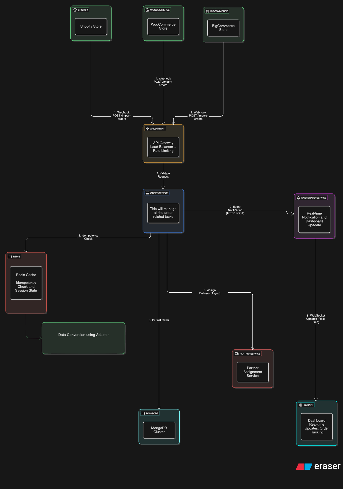

### Functional Requirements
- **Multi-Platform Order Import**: Support order data from Shopify, WooCommerce, and other e-commerce platforms
- **Universal API Endpoint**: Single POST /import-orders endpoint handling diverse platform formats
- **Data Standardization**: Transform platform-specific schemas into unified internal format
- **Idempotency Handling**: Prevent duplicate order processing when same order sent multiple times
- **Real-Time Processing**: Process incoming orders immediately upon receipt

### Non-Functional Requirements
- **Scalability**: Handle 10,000+ orders per hour scaling requirement
- **Performance**: Sub-second response times for order import requests
- **Reliability**: Zero duplicate orders, robust error handling
- **Availability**: High uptime for continuous order processing
- **Data Integrity**: Accurate transformation across different platform schemas

## Solution Overview:

Microservices-based architecture, to distribute the workload and isolate failures, along with comprehensive fallback mechanisms, ensuring higher customer satisfaction and system reliability.

## Business Impact:

Revenue Protection: High availability during service outages with graceful degradation
Customer Satisfaction: Fast response times with real-time order updates
Operational Efficiency: Cost-effective compared to traditional message broker solutions
Scalability: Linear scaling as order volume grows


## Overall Architecture:


## System Flow

The order import system processes incoming webhooks from multiple e-commerce platforms through a standardized pipeline:

### Core Processing Steps

**Step 1: Webhook Reception**
E-commerce platforms (Shopify, WooCommerce, BigCommerce) send order data via webhook POST requests to our unified `/import-orders` endpoint.

**Step 2: Request Validation** 
API Gateway validates incoming requests, handles authentication, and applies rate limiting before forwarding to Order Service.

**Step 3: Idempotency Check**
Order Service generates composite key (`platform_store_uid_platform_order_id`) and checks Redis for duplicate processing. Returns cached response if order already processed.

**Step 4: Data Transformation**
Platform-specific adapters convert incoming order data to our universal schema format, standardizing fields across different e-commerce platforms.

**Step 5: Order Persistence**
Validated and transformed order data gets stored in MongoDB with proper indexing for fast retrieval and reporting.

**Step 6: Partner Assignment**
Order Service triggers Partner Service asynchronously to assign delivery partners based on location, capacity, and business rules.

**Step 7: Event Notification**
Order Service sends HTTP POST to Dashboard Service via persistent HTTP connections with order status updates and partner assignment information.

**Step 8: Real-time Updates**
Dashboard Service pushes live updates to web dashboard via WebSocket connections, keeping users informed of order status changes.

### Background Operations

**Duplicate Prevention**: Redis maintains 1-hour cache of processed orders with MongoDB constraints as backup for reliability.

**Cache Optimization**: Stores only composite keys and status (50 bytes per order) in Redis for memory efficiency while keeping detailed data in MongoDB.

### Error Handling & Recovery

**Redis Failure**: System falls back to MongoDB duplicate checking with slight performance impact (50ms vs 10ms).

**Partner Service Delays**: Orders queue for background processing with customer notifications rather than failing requests.

**Platform Webhook Failures**: Exponential backoff retry with platform-specific rate limiting to handle delivery issues.

**Database Outages**: Orders temporarily queue in Redis during short outages, with 5-minute recovery window for automatic processing.

The complete pipeline typically processes orders within 100-200ms, supporting 10,000+ orders per hour through horizontal scaling of Order Service instances.


## Technical Implementation Details:
### 1. Universal Data Schema Design
 - An __adapter pattern__ to standardize data from various sources into a common format for easy handling and processing for each platform.

**Why not other approaches?**
I considered a few different ways to handle this:
- Writing separate parsers for each platform - but that would mean maintaining tons of different code as we add more platforms
- Just storing everything as raw JSON - but then querying becomes a nightmare and you lose data validation
- Making all platforms send data in our format - not realistic since we can't control external platforms
__Implementation__

See implementation in: [`question1-code/adapters.js`](./question1-code/adapters.js)

What I built:
- Separate adapter class for each platform (Shopify, WooCommerce)
- Factory that automatically picks the right adapter
- Input validation to catch bad data early
- Error handling so one bad order doesn't crash the system

__Data Schema & Output Examples__

See standardized data schema and examples in: [`question1-code/order_schema.js`](./question1-code/order_schema.js)

The unified schema gives us:
- Same field names whether it's Shopify or WooCommerce data
- All customer and order info in one consistent format
- Original platform data preserved for debugging
- Built-in validation to catch data issues  


### 2. Idempotency Strategy
Using Composite Redis Key with Database Constraint Backup

platform + store_uid + platform_order_id = Unique Identifier

**Other approaches I looked at:**
- **Database only**: Reliable but slower (50-100ms per check)
- **Redis only**: Super fast but if Redis goes down, we might process duplicates  
- **UUID generation**: Works but doesn't use the actual order data, so same order could get different UUIDs
- **Hybrid approach** (what I chose): Fast Redis checks with database backup for reliability

__Implementation:__
```js
// Redis Key Format: order_dedup:platform_store_uid_platform_order_id
const idempotencyKey = `order_dedup:${platform}_${store_uid}_${platform_order_id}`;

// Fast Redis check (10ms average)
const isDuplicate = await redis.exists(idempotencyKey);
if (isDuplicate) {
  return { status: 'duplicate', processed_at: '2025-09-24T12:00:00Z' };
}

// Set processing flag with 1-hour expiry
await redis.setex(idempotencyKey, 3600, JSON.stringify({
  status: 'processing',
  timestamp: Date.now()
}));
```
Expiry time for the time being is set to 1 hour, because people usually check the status of their order and drive within that time frame. This can be adjusted based on real-world usage patterns.

__Caching Strategy__ - For the use side if they are checking the status of their order very frequently, we can cache the status of the order in their local storage and will only update when the redis recives an update, so it would be a event based update, saving a lot of unnecessary calls to the server. while still maintaining the accuracy and right customer experience.

__Data Optimzation__ we are storing only the compisite key and status of the order in redis, so it would be a very small amount of data (approx 50 bytes per order), and thats what we need more often, so it would be a very efficient use of memory. More details about the order can be fetched from the main database when needed.


__High Availability and Reliability of System__ if the redis ever goes down or misses a request we will fallback to main database. Eventually providing good customer experience during a redis outage instead of failing all the requests.

### 3. Enterprise Scaling Architecture
__Design Decision:__ Microservices with Event-Driven Communication


**Architecture options I considered:**
- **Monolithic**: Simple to start but becomes a bottleneck as we scale
- **Microservices**: More complex but allows independent scaling of different parts
- **Serverless**: Good for spiky traffic but cold starts can be problematic
- **Message Queue Heavy**: Very reliable but adds operational complexity and cost


__Service Isolation Strategy:__

### **Order Processing Service** (CPU-Intensive)
- **Responsibility**: Data transformation, validation, business logic
- **Scaling**: Horizontal (3-10 instances based on CPU usage)
- **Resource Profile**: High CPU, Medium Memory

### **Notification Service** (Connection-Intensive)  
- **Responsibility**: WebSocket management, real-time updates
- **Scaling**: Vertical (larger instances with more memory)
- **Resource Profile**: Low CPU, High Memory (connection state)

**For service communication, I chose HTTP over message queues because:**
- The latency difference (1-3ms vs 0.5ms) doesn't matter for our use case
- HTTP is much simpler to debug and operate
- No need to manage broker infrastructure and dead letter queues
- Basic retry logic is sufficient for our reliability needs


### 4. Advanced Resilience Patterns
__Problem Statement:__ Service failures should not cascade or result in data loss

**Resilience Strategy**: Instead of failing orders during outages, we give customers options and keep processing what we can.

**Implementation**: [`question1-code/resilience_patterns.js`](./question1-code/resilience_patterns.js)

**How it works:**
- **First 30 seconds**: Try to assign a delivery partner normally
- **If delayed**: Queue the order and let customer choose to wait or cancel
- **Extended attempt**: If customer waits, keep trying for another 60 seconds  
- **Still no partner**: Offer to process in background or cancel the order
- **Background mode**: Keep looking for partners and notify customer when found

**What customers see:**
- **First 30 seconds**: "Finding delivery partner..."
- **If delayed**: "Taking longer than usual to find a partner"
- **Customer choice**: "Wait 1 more minute?" OR "Cancel order"
- **Still no luck**: "Process in background and we'll notify you?" OR "Cancel order"
- **Background mode**: Keep trying to find partners and update customer when we do

**Our approach vs typical systems:**
- **Typical**: Just reject orders when partner service is down
- **Our way**: Keep processing orders and give customers choices during delays


## Risk Analysis & Mitigation
__Identified Risks & Mitigation Strategies__

### 1. Database Failure (High Impact, Low Probability)
- **Risk**: Complete order processing halt
- **Mitigation**: Read replicas + automated failover + 30-second RTO
- **Fallback**: Queue orders in Redis for 5-minute database recovery window

### 2. Redis Cache Failure (Medium Impact, Low Probability)
- **Risk**: Duplicate orders during cache rebuild
- **Mitigation**: Database constraint as secondary check + immediate cache warming
- **Impact**: Response times increase from 10ms to 50ms during fallback period

### 3. Partner Service Extended Outage (Low Impact, Medium Probability)
- **Risk**: All orders assigned to default partners
- **Mitigation**: Smart circuit breaker + background optimization + manual reassignment tools
- **Business Continuity**: 100% order processing continues

### 4. API Rate Limiting from E-commerce Platforms
- **Risk**: Webhook delivery failures
- **Mitigation**: Exponential backoff retry + platform-specific rate limiting + status page integration