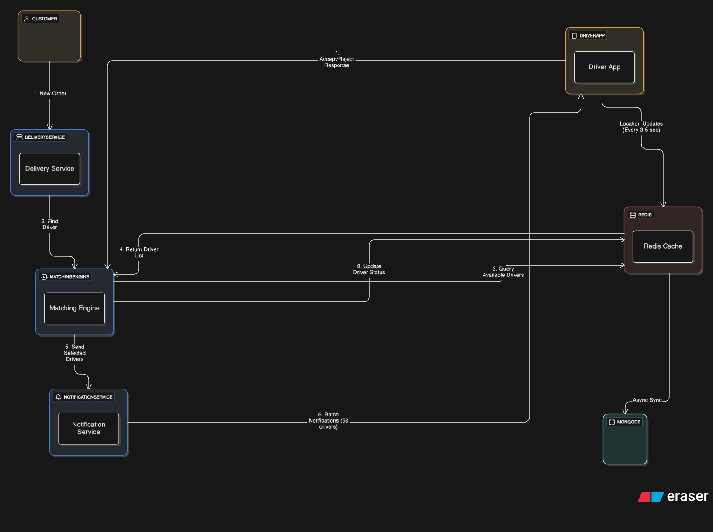

### Functional Requirements
- Match incoming delivery orders to nearest available drivers
- Handle real-time GPS location updates (every 3-5 seconds)
- Manage driver availability changes dynamically
- Process equidistant driver scenarios fairly

### Non-Functional Requirements
- **Latency**: <5 seconds average matching time
- **Throughput**: Support 1000+ orders per minute at peak
- **Availability**: 99.9% uptime with graceful degradation
- **Consistency**: Eventual consistency acceptable for location data

## Summary
In this solution I have comprehensively tackled all the possible edge cases and scenarios for a real-time driver matching system, to achieve optimal performance, fairness, reliability, and scalability. The architecture leverages a hybrid approach using Redis for low-latency operations and MongoDB for durable storage, ensuring both speed and data integrity.

Issues addressed:
1. Distribution of order to the driver who are equidistant from the pickup location.
2. Handling scenarios where no drivers are available within the specified radius.
3. Ensuring the fair distribution of orders among drivers over time.
4. Minimizing latency along with the operational cost of the system.
5. Handling the case where drivers are not accepting the order due to any reason.
6. Handling peak loads and ensuring system and maximum driver reach out for best customer experience.


## Architecture Diagram




## System Flow

The matching process follows an iterative radius expansion approach with sophisticated batching and fairness mechanisms:

### Core Matching Process

**Step 1: New Order Processing**
Customer places order, Delivery Service validates request and forwards GPS coordinates to Matching Engine.

**Step 2: Driver Search Initialization** 
Matching Engine starts with 2km search radius from pickup location, with maximum thresholds of 15km (urban) or 25km (suburban).

**Step 3: Pre-sorted Driver List Query**
System retrieves cached driver list from Redis (refreshed every 3-10 minutes based on peak demand). This avoids expensive real-time geospatial queries against MongoDB.

**Step 4: Distance Filtering & Lock Acquisition**
For each driver batch (50 drivers):
- Apply Haversine formula for precise distance calculation
- Skip drivers in 10-minute cooldown period 
- Acquire Redis distributed locks (10-second timeout) to prevent double-assignment to the drivers.
- Filter drivers within current search radius

**Step 5: Weighted Scoring for Equidistant Drivers**
When multiple drivers exist within 250m tolerance:
```
Final Score = (Rating × 0.4) + (Fairness × 0.3) + (Time × 0.2) + (Random × 0.1)
```
- **Fairness Score**: Inversely proportional to daily delivery count (max 20/day)
- **Time Score**: Higher for drivers with longer idle periods
- **Random Factor**: Prevents drivers from gaming the algorithm

**Step 6: Progressive Notification Strategy**
Start with 50-driver batches. If no responses, expand batch sizes and remove cooldowns from previous rounds. During peak hours, we re-contact drivers who were notified earlier to increase our chances of getting someone.

**Step 7: Response Collection & Assignment**
System waits 10 seconds for driver responses (distributed lock timeout). First driver to accept wins assignment. All notified drivers enter 10-minute fairness cooldown regardless of their response to prevent order cherry-picking.

**Step 8: State Synchronization**
Winner's status updated in Redis immediately, other locks released. Data eventually syncs to MongoDB for persistence and analytics.

### Background Operations

**Continuous Location Updates**: Driver apps send GPS coordinates every 3-5 seconds via HTTP requests for real-time location tracking.

**Periodic Cache Refresh**: Redis driver availability list refreshed every 3-10 minutes, with higher frequency during detected peak hours.

### Failure Recovery Mechanisms

**No Drivers in Current Radius**: Progressive escalation strategy activates:
- Expand search radius by 2km increments  
- Increase batch sizes (50→75→100→150→200) as radius grows
- During peak hours: Remove cooldowns from all previously notified drivers
- Continue until maximum service area reached (15km urban, 25km suburban)

**Batch Non-Response**: When nobody responds:
- Remove cooldowns from earlier batches during peak hours
- Expand radius and batch size at the same time for better coverage
- Contact previously notified drivers again with the larger pool
- Keeps the system stable while improving our odds of finding someone

**Concurrent Accept Conflicts**: Redis distributed locking (10-seconds) ensures atomic assignment - first successful lock wins, others immediately released.

**System Overload**: Batching strategy (of 50 each) with 2-3 second intervals prevents notification service collapse during peak loads.

## Pseudocode Implementation

See algorithm implementation: [`question2-code/pseudocode.js`](./question2-code/pseudocode.js)


### Service Architecture
**Microservices Design** chosen over monolithic for:
- Independent scaling of matching vs. location services
- Technology diversity (Redis for speed, MongoDB for persistence)
- Fault isolation and easier maintenance

**Core Services:**
1. **Delivery Management Service** - Order intake and customer communication, like order status updates, ratings, etc.
2. **Rider Management Service** - Driver state and location management, this entirely is responsible for the co-ordination with different services and the main entry point for the driver app.
3. **Matching Engine** - Core algorithm with weighted scoring
4. **Notification Service** - Batched driver notifications, to optimise the driver reach out to avoid overwhelming the system.

### Data Architecture
**Hybrid Database Strategy:**
- **Redis**: Real-time location data, availability status, distributed locks, once the driver is reached out (a 10 minutes base cool-down period with dynamic changes according to the business needs, and peak loads) is set to avoid overloading the driver with requests and keeping the system fair and accountable.
- **MongoDB**: Persistent driver profiles, order history, analytics

## Technical Decisions & Trade-offs

### 1. Distance Tolerance (250m vs 100m)
**Decision:** 250m tolerance for "equidistant" drivers  
**Rationale:** 
- Better driver fairness and retention
- Minimal customer impact (30-60 seconds difference)
- Reduces location gaming by drivers and provides a fair opportunity to more deserving drivers.

### 2. Weighted Scoring Algorithm
**Decision:** Multi-factor scoring (Rating 40%, Fairness 30%, Time 20%, Random 10%)  
_fairness_ here means the that there should not be the case where only a few drivers are getting all the orders and rest of them are idle.

we will use this mathematical logic to create a sorted list of drivers based on their scores and then we will use this sorted list to reach out to the drivers in batches.  
**Rationale:**
- Prevents top-driver monopolization
- Maintains service quality through rating priority, ensuring top tier customer satisfaction.
- Ensures fair work distribution

### 3. Progressive Batching & Escalation Strategy
**Decision:** Dynamic batch sizing with intelligent escalation  

**Initial Strategy:** Start with 50 drivers per batch, 2-3 second intervals between batches
**Escalation Logic:** When no responses received:
1. Expand search radius by 2km increments
2. Progressively increase batch sizes: 50→75→100→150→200 drivers
3. During peak hours: Remove cooldowns from all previously notified drivers  
4. Re-include previously contacted drivers in expanded search
5. Continue until reaching service limits (15km urban, 25km suburban)

**Peak Hour Enhancement:** System becomes more aggressive during high demand:
- Cooldown removal for maximum driver pool utilization
- Faster batch size progression to ensure order fulfillment
- Prevents customer experience degradation during busy periods

**Rationale:**
- Prevents system overload while maximizing coverage
- Balances fairness with business continuity during peak demand  
- Natural fallback with clear termination thresholds

### 4. Dynamic List Refresh
**Decision:** Peak-aware refresh intervals (3-10 minutes)  
we will keep updating the list of available drivers in redis every 3-10 minutes based on the peak hours and the business needs, this will ensure that we have the most up-to-date list of drivers available for matching and also it will reduce the load on the system by not updating the list too frequently.  
**Rationale:**
- Balances freshness with computational cost
- Adapts to business demand patterns
- Prevents stale driver data

### 5. Dual Timeout Strategy
**Decision:** 10-second distributed locks + 10-minute fairness cooldowns  
**10-second locks:** Prevent multiple simultaneous order assignments to same driver  
**10-minute cooldowns:** Applied to all notified drivers to prevent cherry-picking behavior  
**Rationale:**
- Prevents double-assignment in concurrent scenarios
- Ensures drivers can't selectively accept only high-value orders
- Maintains fairness across driver ecosystem

## Key Assumptions

### Business Assumptions
- **Service Areas:** Urban (15km max), Suburban (25km max) [from customer's location]
- **Driver Capacity:** Maximum 20 deliveries per day per driver
- **Peak Hours:** Dynamic detection based on order volume
- **Cooldown Period:** 10 minutes between assignments for fairness

### Technical Assumptions
- **GPS Accuracy:** 3-5 meter variance acceptable
- **Network Latency:** <100ms between services
- **Driver App Connectivity:** Persistent HTTP connections for location updates
- **Database Performance:** Redis <1ms, MongoDB <50ms query times

## Alternatives Considered

### 1. Geospatial Query Approach
**Rejected:** GEORADIUS for every query  
**Reason:** Performance bottleneck at scale, excessive computational overhead

### 2. Queue-Based Processing
**Rejected:** Single queue for all orders  
**Reason:** Creates driver monopolization, poor fairness distribution

### 3. Machine Learning Matching
**Rejected:** AI-based driver selection  
**Reason:** Over-engineering for current scale, interpretability concerns

### 4. Synchronous Database Updates
**Rejected:** Real-time MongoDB writes    
**Reason:** Performance impact, unnecessary for location data
