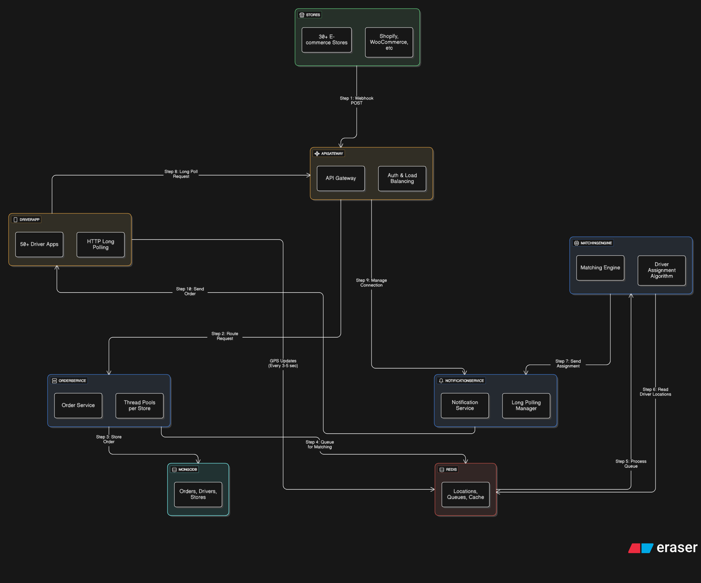

## Functional Requirements

- Support direct API connections to 30+ e-commerce stores simultaneously
- Handle secure API calls from e-commerce stores (Shopify, WooCommerce, etc.)
- Dispatch real-time updates to 50+ mobile driver applications
- Process order data from multiple store integrations
- Manage driver assignment and notification workflow
- Maintain persistent connections for instant mobile app updates

## Non-Functional Requirements

- **Scalability**: Handle 30+ concurrent store connections and 50+ driver connections
- **Performance**: Real-time dispatch updates with minimal latency
- **Security**: Secure API authentication and authorization for store integrations
- **Reliability**: System remains operational even if individual store integrations fail
- **Fault Tolerance**: Graceful handling when specific APIs (e.g., Shopify) are down
- **Availability**: High uptime for continuous order processing and driver communication

## Architecture Overview

### Core Components
- **API Gateway**: Kong for authentication, rate limiting, and load balancing
- **Order Service**: Handles webhook processing with per-store thread pools
- **Matching Engine**: Assigns orders to best available drivers using location-based algorithm
- **Notification Service**: Manages HTTP long polling connections to driver apps
- **MongoDB**: Persistent storage for orders, drivers, and store configurations
- **Redis**: Real-time data (driver locations, BullMQ queues, connection tracking)

### 

## Architecture Diagram

### System Flow: A Walkthrough

#### 1. Order Ingestion
- **Step 1: Webhook Reception:** Store sends POST webhook → `API Gateway`
- **Step 2: Validation & Routing:** `API Gateway` authenticates and routes → `Order Service`  
- **Step 3: Data Persistence:** `Order Service` validates and stores → `MongoDB`
- **Step 4: Queuing for Matching:** `Order Service` creates job → `Redis (BullMQ queue)`

#### 2. Driver Matching (Background Processing)
- **Step 5: Job Consumption:** `Redis` triggers → `Matching Engine` processes queued job
- **Step 6: Location Query:** `Matching Engine` reads driver locations → `Redis`
- **Step 7: Assignment:** `Matching Engine` sends driver assignment → `Notification Service`

#### 3. Real-Time Driver Communication
- **Step 8: Long Poll Setup:** `Driver App` establishes connection → `API Gateway`
- **Step 9: Connection Management:** `API Gateway` routes connection → `Notification Service`
- **Step 10: Order Delivery:** `Notification Service` sends order details → `Driver App`

#### 4. GPS Location Updates (Continuous Background Process)
- **Background:** `Driver App` sends GPS coordinates every 3-5 seconds directly to `Redis` for real-time location tracking.

## Fault Tolerance Strategy

### 1. Resource Isolation (Bulkhead Pattern)
- **Adaptive thread allocation**: High-volume stores (Shopify Enterprise) get dedicated thread pools, smaller stores share resources based on their SLA tier
- **Backup thread pool**: Keep idle threads for overflow and timeout scenarios
- **Timeout + failover**: If platform threads get stuck, timeout the slow work and move it to backup threads so other orders from that platform can still process
- **Complete isolation**: If one platform's entire thread group fails, other platforms are unaffected

### 2. Timeout + Queue Fallback
- **Adaptive timeouts**: Enterprise stores get longer processing windows (45s), standard stores timeout faster (15s) to prevent resource hogging
- **Queue overflow protection**: When threads busy → BullMQ queue
- **No data loss**: Failed requests queued for retry with priority based on store tier

### 3. Circuit Breaker Pattern  
- **Store-level circuit breakers**: Auto-disable problematic stores
- **Health monitoring**: Track failure rates per store
- **Gradual recovery**: Slowly re-enable after cooling period

## Key Architecture Benefits

### Handles Scale Requirements
- **Independent scaling**: Each service scales based on its own load patterns
- **Advanced thread isolation**: Each platform gets dedicated thread pools, plus we keep idle threads as backup. If a platform's threads get stuck, we timeout and move the work to common backup threads so other orders from the same platform aren't blocked
- **Queue buffering**: BullMQ handles traffic spikes without dropping orders

### Reliability Through Redundancy
- **Multiple safety nets**: If threads are busy, queue takes over; if one store fails, others keep running
- **Distributed architecture**: No single component can take down the whole system
- **Persistent queues**: BullMQ keeps orders safe even during service restarts

### Real-Time Communication
- **Long polling with smart timeouts**: Connection duration based on driver activity - active drivers get longer connections (30s), idle drivers get shorter ones (10s) to free up resources
- **Redis for speed**: Driver locations cached for fast matching queries
- **Background processing**: Matching happens async so API responses stay fast

## Technology Decision Rationale

### Why Kong over Nginx?
- **Plug-and-play architecture**: Kong works well with our existing MongoDB + Redis + microservices stack
- **Mature plugin ecosystem**: Built-in authentication, rate limiting, and monitoring plugins reduce custom development
- **API-first design**: Native support for multiple authentication methods (API keys, OAuth, JWT) for different store integrations
- **Service discovery**: Automatic load balancing and health checks for our microservices
- **Operational simplicity**: Single gateway to manage vs multiple nginx configs

### Why BullMQ over RabbitMQ?
- **Infrastructure reuse**: We're already running Redis, so BullMQ uses existing infrastructure instead of adding another managed service
- **Cost efficiency**: No additional service costs or maintenance overhead
- **Performance**: Redis-based queues are faster for our use case than disk-based RabbitMQ
- **Operational complexity**: One less moving part to monitor, backup, and scale

### Scaling Path: 30 → 300 Stores
- **Horizontal scaling**: Each service (Order, Matching, Notification) scales independently based on load
- **Thread pool expansion**: Dynamic thread allocation grows with store count - 300 stores might need 50+ thread pools
- **Redis clustering**: Partition driver locations and queues across Redis cluster nodes
- **Database sharding**: MongoDB shards by store_id when we hit query limits
- **Gateway clustering**: Kong instances behind load balancer for API traffic distribution

### Trade-offs We're Making
- **Redis dependency**: BullMQ choice means Redis becomes critical path - if Redis fails, both caching AND queuing stop
- **HTTP vs WebSocket**: HTTP long polling with 3-5s intervals reduces server load vs WebSocket's continuous connection overhead, trading minor latency for simpler scaling and connection management
- **Thread pool complexity**: Managing dynamic thread allocation adds operational overhead vs simple load balancing
- **Kong learning curve**: Team needs Kong expertise vs familiar nginx configurations

## Technical Specifications

### Technology Stack
- **Runtime**: Node.js with Express.js
- **Databases**: MongoDB (persistence) + Redis (real-time + queuing)
- **Message Queue**: BullMQ leveraging existing Redis infrastructure
- **API Gateway**: Kong for API management and traffic control
- **Monitoring**: Built-in health checks and metrics

This setup gives us the reliability and scale we need for 30+ stores and 50+ drivers while keeping order assignment fast and reliable.

